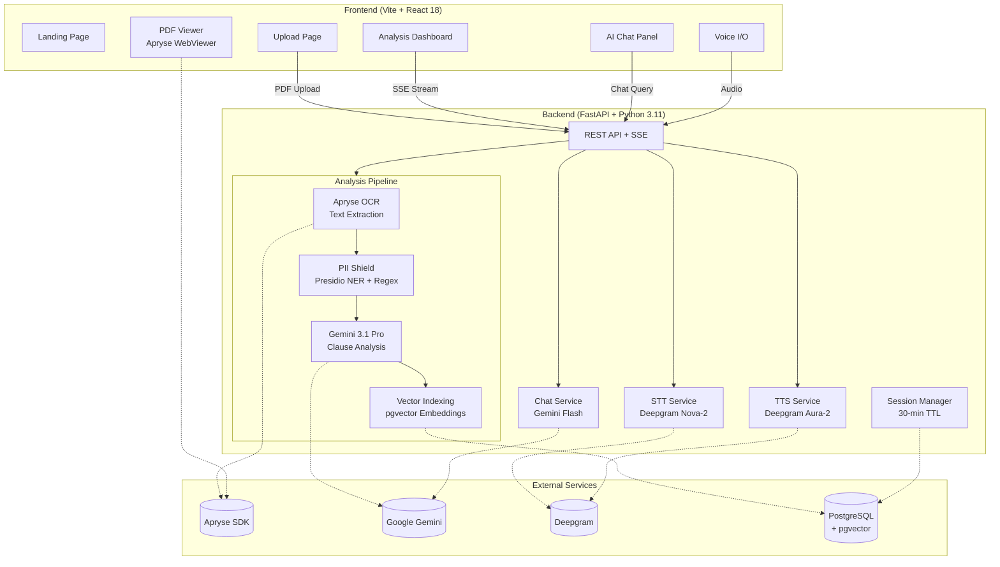

# ClearClause

> **Every clause, crystal clear.** Upload any complex document. Instantly understand what it really says, what's risky, and what to do about it.


## 🎯 The Problem

Contracts, insurance policies, and legal documents are designed to be confusing. The average rental lease is 15+ pages of dense legalese. Health and life insurance policies bury exclusions deep in fine print. Most people sign without understanding what they're agreeing to — giving up rights, accepting unfair terms, or missing critical protections.

**ClearClause fixes this.** Upload any PDF document and our AI pipeline instantly:
- Extracts every clause using Apryse OCR
- Redacts personal information with dual-engine PII detection (Presidio NER + regex) before AI ever sees it
- Classifies each clause by risk category and severity
- Compares your terms against industry standards with a Fairness Score
- Lets you ask questions about your document via text or voice in plain English

## ✨ Features

### 🧠 AI Clause Analysis
Gemini 3.1 Pro analyzes every clause in your document, classifying each as:
- **Rights Given Up** — Things you're agreeing to surrender
- **One-Sided Terms** — Clauses heavily favoring the other party
- **Financial Impact** — Hidden costs, penalties, or financial obligations
- **Missing Protections** — Standard protections absent from your document
- **Standard** — Fair, commonly-seen terms

### 🛡️ PII Shield (Dual-Engine)
Personal information is **automatically detected and redacted** before the document text ever reaches the AI. ClearClause uses a two-layer approach:
1. **Microsoft Presidio NER** — Named entity recognition for robust detection of names, addresses, and financial identifiers with conservative score thresholds per entity type
2. **Regex fallback** — Pattern-based detection for SSNs, emails, phone numbers, credit cards, and dates of birth when Presidio is unavailable

The LLM never sees your raw personal data. PII is restored into clause text only for the final viewer output after analysis is complete.

### ⚖️ Fairness Comparison
A computed **Fairness Score (0–100)** with side-by-side comparison: "Your Document vs Industry Standard" for every non-standard clause, with negotiation suggestions.

### 📄 Annotated PDF Viewer
Apryse WebViewer displays your original PDF with **color-coded clause highlights**. Click any clause in the dashboard to jump directly to its location in the document. Documents are stored securely in PostgreSQL for the duration of the session — surviving pod restarts without touching the filesystem.

### 💬 AI Chat with Dual Retrieval
Ask questions about your document in plain English. The chat service uses **two retrieval strategies**:
1. **Keyword + severity scoring** — Clause relevance scoring with severity boosting (critical ×3, warning ×2)
2. **Semantic retrieval** — pgvector-powered embedding search for meaning-based clause matching

Chat history is **persisted to localStorage** so you don't lose your conversation on page refresh. Requests use AbortController for clean cancellation, and submit is debounced to prevent duplicate sends.

### 🎙️ Voice Input & Voice Output
- **Deepgram Nova-2 STT** — Speak your questions via microphone
- **Deepgram Aura-2 TTS** — AI reads responses and summaries aloud (opt-in "Read Aloud", never auto-plays)

### 📊 Real-Time Progress
Server-Sent Events stream granular pipeline progress:  
`Uploading → OCR Extraction → PII Redaction → AI Analysis → Complete`

### 🔄 Multi-Document Concurrency
Each upload gets a unique session. Multiple documents can be analyzed simultaneously with independent pipelines, per-IP rate limiting, and auto-cleanup (30-min TTL).

## 🏗️ Architecture



## 💻 Tech Stack

| Layer | Technology | Purpose |
|-------|-----------|---------|
| **Frontend** | Vite + React 18 | SPA with routing, context, custom hooks |
| **Backend** | Python 3.11 + FastAPI | Async API with SSE streaming |
| **OCR** | Apryse SDK | PDF text extraction with word-level positions |
| **AI Analysis** | Gemini 3.1 Pro | Clause classification and risk assessment |
| **AI Chat** | Gemini 3 Flash | Fast, conversational document Q&A with dual retrieval |
| **PII Detection** | Presidio NER + Regex | Dual-engine SSN, email, phone, CC, DOB, name, address redaction |
| **Speech-to-Text** | Deepgram Nova-2 | Voice input transcription |
| **Text-to-Speech** | Deepgram Aura-2 | Audio summary generation |
| **PDF Viewer** | Apryse WebViewer v10 | Annotated PDF display with highlights |
| **Database** | PostgreSQL + pgvector | Session persistence, document storage, semantic retrieval |
| **Deployment** | Akamai LKE + Vercel | Kubernetes backend, static frontend |
| **CI/CD** | GitHub Actions | Docker build + auto-deploy to LKE on push |

## 🔐 Privacy & Security

- **PII never reaches the LLM** — Dual-engine detection (Presidio NER + regex) redacts personal data *before* the text is sent to Gemini. PII is only restored in the final viewer output.
- **Documents auto-delete** — PDF bytes are stored in PostgreSQL alongside the session row and share the same 30-minute TTL. When the session expires, the cleanup job deletes the entire row — document bytes included. No files ever persist on disk.
- **Session isolation** — Each document gets an independent session with unique ID, independent progress, and automatic TTL-based cleanup
- **Per-IP rate limiting** — Token bucket middleware (120 req/min) + per-IP concurrent analysis limit to prevent abuse
- **Admin authentication** — Sensitive endpoints (`/api/sessions`) require `X-API-Key` header
- **PDF validation** — Magic-byte (`%PDF-`) validation prevents non-PDF uploads
- **Request safety** — AbortController on frontend requests, submit debouncing, 429-aware error handling on all API calls
- **Secrets management** — Kubernetes secrets for production API keys

## 🚀 Quick Start

### Prerequisites
- Python 3.11+, Node.js 18+
- API Keys: [Gemini](https://makersuite.google.com/app/apikey), [Apryse](https://dev.apryse.com), [Deepgram](https://deepgram.com)
- Optional: PostgreSQL with [pgvector](https://github.com/pgvector/pgvector) extension

### Backend
```bash
cd backend
python -m venv venv && source venv/bin/activate
pip install -r requirements.txt
python -m spacy download en_core_web_lg  # For Presidio PII detection
cp .env.example .env   # Edit with your API keys
python main.py         # http://localhost:8000
```

### Frontend
```bash
cd frontend
npm install
cp .env.example .env   # Set VITE_API_URL
npm run dev            # http://localhost:5173
```

### Environment Variables
| Variable | Required | Description |
|----------|----------|-------------|
| `GEMINI_API_KEY` | Yes | Google Gemini API key |
| `APRYSE_LICENSE_KEY` | Yes | Apryse SDK license |
| `DEEPGRAM_API_KEY` | Yes | Deepgram API key |
| `VECTOR_DB_URL` | No | PostgreSQL connection string (enables Postgres sessions + pgvector) |
| `admin_api_key` | No | API key for admin endpoints |

## 📡 API Endpoints

| Endpoint | Method | Auth | Description |
|----------|--------|------|-------------|
| `/api/analyze` | POST | Rate-limited | Upload PDF → SSE progress stream |
| `/api/analyze/{id}` | GET | — | Poll analysis status |
| `/api/documents/{id}` | GET | — | Serve PDF for WebViewer (from Postgres) |
| `/api/chat` | POST | Rate-limited | Document Q&A with dual retrieval |
| `/api/transcribe` | POST | Rate-limited | Voice → text (Deepgram STT) |
| `/api/voice-summary` | POST | Rate-limited | Text → audio (Deepgram TTS) |
| `/api/sessions` | GET | Admin | List active sessions |
| `/api/session/{id}` | DELETE | — | Cancel & cleanup |
| `/health` | GET | — | Kubernetes health probe |

## 🧱 Project Structure

```
clear-clause/
├── backend/
│   ├── main.py                    # FastAPI app + middleware
│   ├── config.py                  # Pydantic Settings
│   ├── Dockerfile                 # Python 3.11 + spaCy model
│   ├── api/
│   │   ├── router.py              # All route definitions
│   │   ├── schemas.py             # Pydantic models
│   │   └── dependencies.py        # DI, validation, rate limiting
│   ├── services/
│   │   ├── ocr_service.py         # Apryse OCR extraction
│   │   ├── pii_service.py         # Presidio NER + regex PII detection
│   │   ├── analysis_service.py    # Gemini clause analysis
│   │   ├── chat_service.py        # Dual-retrieval document Q&A
│   │   ├── stt_service.py         # Deepgram Nova-2 STT
│   │   ├── tts_service.py         # Deepgram Aura-2 TTS
│   │   ├── vector_store.py        # pgvector semantic retrieval
│   │   ├── pipeline_service.py    # Pipeline orchestration
│   │   └── session_manager.py     # Postgres/in-memory session lifecycle
│   ├── core/
│   │   ├── exceptions.py          # Custom error hierarchy
│   │   ├── rate_limiter.py        # Token bucket + backoff
│   │   └── logger.py              # Structured logging (structlog)
│   └── prompts/
│       └── analysis_prompt.py     # LLM prompt templates
│
├── frontend/
│   └── src/
│       ├── pages/                 # Landing, Upload, Analysis
│       ├── components/
│       │   ├── analysis/          # Dashboard, ClauseCard, CategoryBar, FairnessCompare
│       │   ├── chat/              # AIAssistantPanel, ChatMessage, VoiceInput
│       │   ├── viewer/            # DocumentViewer (Apryse WebViewer)
│       │   └── common/            # ThemeToggle, OfflineBanner, AnalysisOnboarding
│       ├── hooks/useAnalysis.js   # Upload + polling logic
│       ├── context/               # AnalysisContext, ThemeContext
│       └── services/api.js        # API client with 429 handling
│
├── deployment/
│   ├── k8s/deployment.yaml        # K8s Deployment (Recreate) + Service + Ingress
│   └── vercel.json
│
└── .github/workflows/
    └── deploy-backend.yml         # Docker build + auto-deploy to LKE
```

## 🏆 Built For

**DevDash 2026** — Code the Tomorrow.

## 📜 License

MIT License

## 🙏 Credits

- **Gemini API** — AI analysis and conversational chat
- **Apryse** — PDF text extraction and WebViewer rendering  
- **Deepgram** — Voice input (Nova-2 STT) and voice output (Aura-2 TTS)
- **Microsoft Presidio** — Named entity recognition for PII detection
- **Akamai** — Kubernetes hosting on LKE
- **Vercel** — Frontend deployment

---

**Every clause, crystal clear.** ⚡
